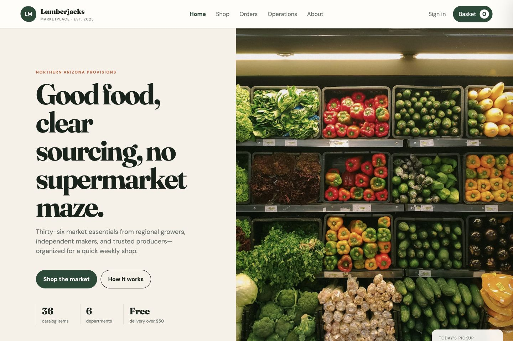

# Aster & Loom Storefront

An editorial commerce experience evolved from my original storefront project, with a complete product collection, detail views, persistent cart, mocked checkout, original CSS artwork, tests, and responsive design.

**[Open the live demo](https://paulrevanthpersonal-lab.github.io/atelier-storefront/)**



## 1. Overview

Aster & Loom is a fictional small-batch design studio. The application balances brand storytelling with real catalog and cart interactions.

## 2. Original-work lineage

This is the professional evolution of my earlier Lumberjacks Store / Organica web build. It preserves the commerce direction while replacing the structure, visual identity, interactions, documentation, and quality automation.

[View the original coursework source at the preserved commit.](https://github.com/MacDevil143/ITC505/tree/f415d5006493f46949c7230174be3ecda8730ce2/WEBSITE%20PAGE)

## 3. Pages

Home journal, product collection, product detail, persistent bag, mocked checkout, and studio About view.

## 4. Product discovery

Shoppers can filter by Home, Wear, and Carry, then sort by editorial order or price.

## 5. Product detail

Each object has a gallery treatment, finish selector, product context, and add-to-bag action.

## 6. Cart and checkout

The local cart persists across refreshes. Checkout validates a demonstration form but sends no information and performs no payment.

## 7. Architecture

Pure catalog rules are separate from DOM state. Read [ARCHITECTURE.md](docs/ARCHITECTURE.md).

## 8. UX system

Oversized serif typography, generous whitespace, terracotta accents, and original abstract product forms create a distinct editorial identity. Read [UX_NOTES.md](docs/UX_NOTES.md).

## 9. Performance and motion

There are no runtime dependencies. Transitions use opacity and transforms and honor reduced motion. Actual refresh rate varies by hardware.

## 10. Quick start

```bash
python3 -m http.server 4173
```

## 11. Tests

```bash
node --test tests/*.test.cjs
```

## 12. Automated screenshots

```bash
./scripts/capture_screenshots.sh
```

## 13. Repository structure

`assets/` contains product rules, behavior, and styles; `docs/` contains design and interview notes; `tests/` covers commerce rules.

## 14. Accessibility

Controls are semantic buttons, forms have labels, the bag exposes state, and motion preferences are respected.

## 15. Privacy and security

No personal data is transmitted. Production totals, pricing, inventory, authentication, and payment must be server validated.

## 16. Interview walkthrough

Use [INTERVIEW_GUIDE.md](docs/INTERVIEW_GUIDE.md) to discuss project evolution and engineering decisions.

## 17. Roadmap

API-backed inventory, real routes, automated accessibility checks, image optimization, and payment-provider test mode.

## 18. License

[MIT](LICENSE)
